# Hi, I'm Aristha 👋

Technical Lead with **8+ years of software engineering experience** across **legacy modernization, architecture, performance engineering, technical leadership, and AI-assisted software delivery**.

I did not start in computer science. I studied **Mechatronics** — and most of my career has followed the same pattern ever since.

  

> **The tools changed. The scale changed. The pattern didn't.**

## Built by Transition

**01 · Origin — Mechatronics → Software**  
My graduation project was an automatic rice weighing and packaging conveyor system combining sensors, C#, Android, and a C# monitoring application. Much of it was self-taught.

**02 · Transition — COBOL → Java / Angular**  
I started at the end of 2017 as a COBOL fresher, then moved into AngularJS, Java 6/8, and SQL. Over time, migration became normal: Java 6 → 8, Flex → Angular, and later Struts → Spring.

**03 · Systems Thinking — Beyond Code**  
Shell, Bash, deployment automation, JMeter, database optimization, API performance, large-data processing, and chart performance taught me to investigate systems end-to-end rather than isolated functions.

**04 · Leadership — Responsibility Beyond Myself**  
I moved from developer to leader and Technical Leader: internal systems, Mendix, a Japanese startup, a securities platform, Korean modernization, Chrome Extension work, and a Spring Boot + React security platform with roughly 40 people. Today my scope includes multiple teams, architecture, estimation, bidding, planning, review, and risk.

**05 · AI Shift — Search → Collaboration**  
For years, search was how I entered unfamiliar domains.

~~~text
Problem → Search → Docs → Compare → Prototype → Understand → Build
~~~

That habit has not disappeared. The interface changed.

> **Search helped me find information.  
> AI helps me turn information into understanding, work, and review.**

My daily toolchain includes **Microsoft Copilot, GitHub Copilot, Claude, ChatGPT, and Codex** — used across research, architecture, implementation, testing, review, and repository-native execution.

**06 · Now / Next — AI Execution, Human Decision**  

~~~text
Unknown
  ↓
AI-assisted Research
  ↓
Faster Understanding
  ↓
AI-assisted Execution
  ↓
Independent Review
  ↓
Evidence
  ↓
Human Decision
~~~

AI can expand engineering capacity, but **context, architecture, trade-offs, risk, validation, and final responsibility remain human**.

The question I am exploring now:

> **How should humans and AI build software together reliably?**

## Selected Work

### Engineering Portfolio

➡️ [View the live portfolio](https://aristha.github.io/PORTFOLIO/)  
➡️ [Browse the source repository](https://github.com/aristha/PORTFOLIO)

Architecture case studies, ADRs, modernization approaches, performance engineering, and technical leadership practices.

### Interactive Engineering Story

➡️ [Explore the interactive story](https://aristha.github.io/aristha/)  
➡️ [Read the detailed journey](./story/ENGINEERING_JOURNEY.md)

The interactive experience is generated from [story/journey.yml](./story/journey.yml), keeping the README, full journey, and future video storytelling aligned to one narrative source.

## Current Focus

**Architecture & Modernization**  
Java · Spring Boot · legacy migration · performance · PostgreSQL

**Frontend & Product Engineering**  
Angular · React · TypeScript · Next.js

**Cloud & Delivery**  
AWS · Docker · Kubernetes · GitHub Actions · deployment automation

**AI-assisted Engineering**  
GitHub Copilot · Claude · ChatGPT · Codex · AI-assisted SDLC · engineering governance

---

**From building software → designing systems → leading teams → expanding engineering capacity with AI.**
